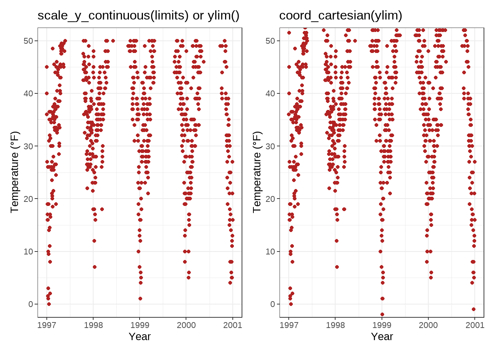

```{r setup, include=FALSE}
knitr::opts_chunk$set(echo = TRUE)
```

**Source**
https://cedricscherer.netlify.app/2019/08/05/a-ggplot2-tutorial-for-beautiful-plotting-in-r/

# Load data and assign Dataset

```{r load_data}
chic <- readr::read_csv("https://raw.githubusercontent.com/Z3tt/R-Tutorials/master/ggplot2/chicago-nmmaps.csv")

tibble::glimpse(chic)
```

```{r head}
head(chic,10)
```

# A Default ggplot
##library(ggplot2)

```{r tidyverse}
library(tidyverse)
```

We specify the data outside `aes()` and add the variables that ggplot maps the aesthetics to inside `aes()`

## 1st: We map the variable date to the x position and temp to the y position
```{r maptemp}
(g <- ggplot(chic, aes(x = date, y = temp)))
```

## 2nd: Now we need to provide geometry, so that ggplot knows how we want to plot that data!

### geom_point() to create a scatter plot:
```{r geompoint}
# geom_point() to create a scatter plot:
g + geom_point()
```

### `geom_line()` to create a line plot (not optimal though):

```{r geomline}
# geom_line() to create a line plot (not optimal though):
g + geom_line()
```

### combine both:

```{r geompointandline}
# combine both:
g + geom_line() + geom_point()
```

## 3rd: Change Properties of Geometries

Within the `geom_*` , you can manipulate visual aesthetics such as the color, shape, and size of your points

```{r geompoint_colour_shape_size}
g + geom_point(color = "firebrick", shape = "diamond", size = 2)
```
Each geom comes with its own properties (called arguments) and the same argument may result in a different change depending on the geom you are using.

```{r geomline_colour_shape_size}
g + geom_point(color = "firebrick", shape = "diamond", size = 2) +
    geom_line(color = "firebrick", linetype = "dotted", size = .3)
```


## 4th: Replace the default ggplot2 theme

And to illustrate some more of ggplot’s versatility, let’s get rid of the grayish default {ggplot2} look by setting a different built-in theme, e.g. `theme_bw()` —by calling `theme_set()` all following plots will have the same black’n’white theme. The red points look way better now!

```{r set_theme}
theme_set(theme_bw())

g + geom_point(color = "firebrick")
```

`theme()` is an essential command to manually modify all kinds of theme elements (texts, rectangles, and lines).

# Working with Axes

## Change Axis Titles

the `labs()` command provides a character string for each label we want to change (here x and y):

```{r axis}
ggplot(chic, aes(x = date, y = temp)) +
  geom_point(color = "firebrick") + 
  labs(x = "Year", y = "Temperature (ºF)")
```

** 💁 You can also add each axis title via `xlab()` and `ylab()`** Example:
```{r axis2}
ggplot(chic, aes(x = date, y = temp)) +
  geom_point(color = "firebrick") +
  xlab("Year") + 
  ylab("Temperature (ºF")
```

The code below also allows to add not only symbols but e.g. superscripts (with the use of `^`):

```{r axis_superscripts}
ggplot(chic, aes(x = date, y = temp)) +
  geom_point(color = "firebrick") +
  labs(x = "Year", y = expression(paste("Temperature (", degree ~ F, ")"^"(Hey, why should we use metric units?!)")))
```

## Increase Space between Axis and Axis Titles

We can change the properties of all or particular text elements (here axis titles) by overwriting the default `element_text()` within the `theme()` call:

```{r axis3}
ggplot(chic, aes(x = date, y = temp)) +
  geom_point(color = "firebrick") +
  labs(x = "Year", y = "Temperature (°F)") +
  theme(axis.title.x = element_text(vjust = 0, size = 15),
        axis.title.y = element_text(vjust = 2, size = 15))
```

the `vjust` command refers to the vertical alignment, which usually ranges between 0 and 1, **but you can also specify values outside that range**

- `vjust` (which is correct form the label’s perspective)

- but you can also change the distance by specifying the margin of both text elements:

```{r margindistance}
ggplot(chic, aes(x = date, y = temp)) +
  geom_point(color = "firebrick") +
  labs(x = "Year", y = "Temperature (°F)") +
  theme(axis.title.x = element_text(margin = margin(t = 10), size = 15),
        axis.title.y = element_text(margin = margin(r = 10), size = 15))
```

The labels **t** and **r** within the margin() object refer to **top** and **right**

- You can also specify the four margins as margin (t, r, b, l). Note that we now have to change the right margin to modify the space on the y axis, not the bottom margin.

💡 A good way to remember the order of the margin sides is “t-r-oub-l-e”.

## Change Aesthetics of Axis Titles
Within the e`lement_text()` we can for example overwrite the defaults for size, color, and face:

```{r element_text}
ggplot(chic, aes(x = date, y = temp)) + 
  geom_point(color = "firebrick") + 
  labs(x = "Year", y = "Temperature (ºF)") + 
  theme(axis.title = element_text(size = 15, color = "firebrick", face = "italic"))
```

The `face` argument can be used to make the font `bold` or `italic` or even `bold.italic`.

```{r face}
ggplot(chic, aes(x = date, y = temp)) +
  geom_point(color = "firebrick") +
  labs(x = "Year", y = "Temperature (°F)") +
  theme(axis.title.x = element_text(color = "sienna", size = 15),
        axis.title.y = element_text(color = "orangered", size = 15))
```

💁 You could also use a combination of `axis.title` and `axis.title.y`, since `axis.title.x` inherits the values from `axis.title`. Example:

```{r axis.title}
ggplot(chic, aes(x = date, y = temp)) + 
  geom_point(color = "firebrick") + 
  labs(x = "Year", y = "Temperature (ºF)") + 
  theme(axis.title = element_text(color = "sienna", size = 15), 
        axis.title.y = element_text(color = "orangered", size = 15))
```

One can modify some properties for both axis titles and other only for one or properties for each on its own:

```{r modify_axis_titles}
ggplot(chic, aes(x = date, y = temp)) +
  geom_point(color = "firebrick") + 
  labs(x = "Year", y = "Temperature (ºF)") + 
  theme(axis.title = element_text(color = "sienna", size = 15, face = "bold"), axis.title.y = element_text(face = "bold.italic"))

```

## Change Aesthetics of Axis Text

You can also change the appearance of the axis text (*here the numbers*) by using `axis.text`and/or the subordinated elements `axis.text.x` and `axis.text.y`:

```{r modify_axis_text}
ggplot(chic, aes(x = date, y = temp)) +
  geom_point(color = "firebrick") +
  labs(x = "Year", y = "Temperature (°F)") +
  theme(axis.text = element_text(color = "dodgerblue", size = 12),axis.text.x = element_text(face = "italic"))
```
## Rotate Axis Text
```{r rotate_axis_text}
ggplot(chic, aes(x = date, y = temp)) +
  geom_point(color = "firebrick") +
  labs(x = "Year", y = "Temperature (°F)") +
  theme(axis.text.x = element_text(angle = 50, vjust = 1, hjust = 1, size = 12))
```

## Remove Axis Text & Ticks
```{r remove_axis_text_ticks}
ggplot(chic, aes(x = date, y = temp)) +
  geom_point(color = "firebrick") +
  labs(x = "Year", y = "Temperature (°F)") +
  theme(axis.ticks.y = element_blank(),
        axis.text.y = element_blank())
```
`element_blank()` removes the element (and thus is not considered an official element)

💡 Use it if you want to get rid of a theme element

## Remove Axis Titles

We could again use `theme_blank()` but it is way simpler to just remove the label in the `labs()` (or `xlab()`) call:

```{r remove_axis_titles}
ggplot(chic, aes(x = date, y = temp)) +
  geom_point(color = "firebrick") +
  labs(x = NULL, y = "")
```
💡 Note that NULL removes the element (similarly to element_blank()) while empty quotes "" will keep the spacing for the axis title and simply print nothing.

## Limit Axis Range

You can ZOOM IN instead of subsetting your data:

```{r Zoom_limit}
ggplot(chic, aes(x = date, y = temp)) +
  geom_point(color = "firebrick") +
  labs(x = "Year", y = "Temperature (°F)") +
  ylim(c(0, 50))
```

You can also use `scale_y_continuous(limits = c(0, 50))` or `coord_cartesian(ylim = c(0, 50)`). The former removes all data points outside the range while the second adjusts the visible area and is similar to `ylim(c(0, 50))`. 
*You may wonder:* So in the end both result in the same. But not really, there is an important difference—compare the two following plots:

```{r imageStart, echo=FALSE, out.width="20%"}

```

You might have spotted that on the left there is some empty buffer around your y limits while on the right points are plotted right up to the border and even beyond. This perfectly illustrates the subsetting (left) versus the zooming (right). To show why this is important let’s have a look at a different chart type, a box plot:

```{r imageStart2, echo=FALSE, out.width="20%"}
knitr::include_graphics("images/axis-limit-comp-box-1.png")
```
*...* Because scale_x|y_continuous() subsets the data first, we get completely different (and wrong, at least if in the case this was not your aim) estimates for the box plots! I hope you don’t have to go back to your old scripts now and check if you maybe have manipulated your data while plotting and did report wrong summary stats in your report, paper or thesis…

## Force Plot to Start at Origin

You can also force R to plot the graph starting at the origin:

```{r plot_graph_from_origin}

library(tidyverse)

chic_high <- dplyr::filter(chic, temp > 25, o3 > 20)

ggplot(chic_high, aes(x = temp, y = o3)) +
  geom_point(color = "darkcyan") +
  labs(x = "Temperature higher than 25°F",
       y = "Ozone higher than 20 ppb") +
  expand_limits(x = 0, y = 0)
```
💁 Using `coord_cartesian(xlim = c(0, NA), ylim = c(0, NA))` will lead to the same result:

```{r coord_cartesian}
library(tidyverse)

chic_high <- dplyr::filter(chic, temp > 25, o3 > 20)

ggplot(chic_high, aes(x = temp, y = o3)) +
  geom_point(color = "darkcyan") +
  labs(x = "Temperature higher than 25°F",
       y = "Ozone higher than 20 ppb") +
  coord_cartesian(xlim = c(0, NA), ylim = c(0, NA))
```

But again, we can force it to literally start plotting from the origin
```{r from_origin2}
ggplot(chic_high, aes(x = temp, y = o3)) +
  geom_point(color = "darkcyan") +
  labs(x = "Temperature higher than 25°F",
       y = "Ozone higher than 20 ppb") +
  expand_limits(x = 0, y = 0) +
  scale_x_continuous(expand = c(0, 0)) +
  scale_y_continuous(expand = c(0, 0)) +
  coord_cartesian(clip = "off")
```
💡 The argument clip = "off" in any coordinate system, always starting with coord_*, allows to draw outside of the panel area.

## Axes with Same Scaling


Here, let’s plot temperature against temperature with some random noise.

The `coord_equal()` is a coordinate system with a specified ratio representing the number of units on the y-axis equivalent to one unit on the x-axis. The default, `ratio = 1`, ensures that one unit on the x-axis is the same length as one unit on the y-axis:

```{r coord_fixed}
ggplot(chic, aes(x = temp, y = temp + rnorm(nrow(chic), sd = 20))) +
  geom_point(color = "sienna") +
  labs(x = "Temperature (°F)", y = "Temperature (°F) + random noise") +
  xlim(c(0, 100)) + ylim(c(0, 150)) +
  coord_fixed()
```

