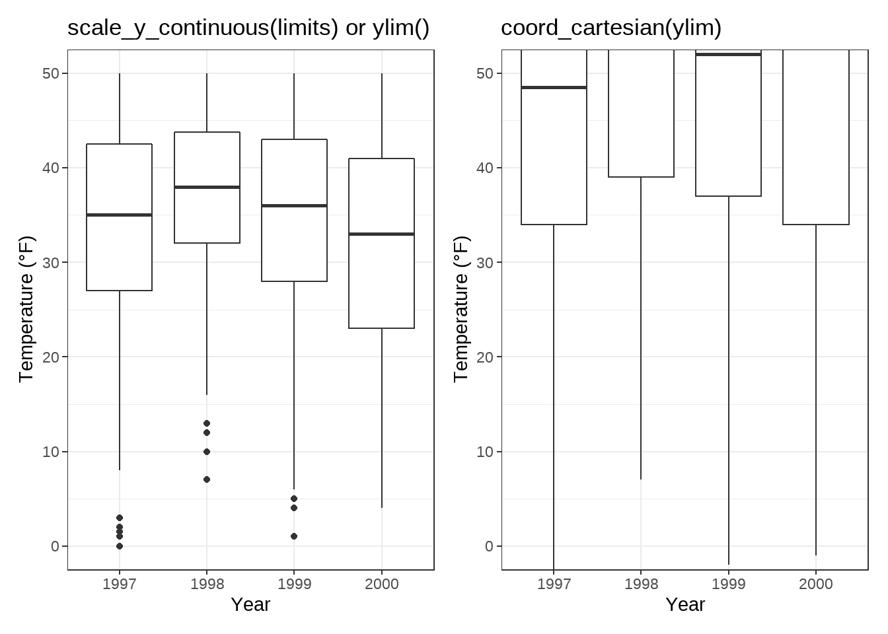

```{r setup, include=FALSE, eval=FALSE}
knitr::opts_chunk$set(echo = TRUE)
```


**Source**
https://cedricscherer.netlify.app/2019/08/05/a-ggplot2-tutorial-for-beautiful-plotting-in-r/

# Load data and assign Dataset

```{r load_data}
chic <- readr::read_csv("https://raw.githubusercontent.com/Z3tt/R-Tutorials/master/ggplot2/chicago-nmmaps.csv")

tibble::glimpse(chic)
```

```{r head}
head(chic,10)
```

# A Default ggplot
##library(ggplot2)

```{r tidyverse}
library(tidyverse)
```

We specify the data outside `aes()` and add the variables that ggplot maps the aesthetics to inside `aes()`

## 1st: We map the variable date to the x position and temp to the y position
```{r maptemp}
(g <- ggplot(chic, aes(x = date, y = temp)))
```

## 2nd: Now we need to provide geometry, so that ggplot knows how we want to plot that data!

### geom_point() to create a scatter plot:
```{r geompoint}
# geom_point() to create a scatter plot:
g + geom_point()
```

### `geom_line()` to create a line plot (not optimal though):

```{r geomline}
# geom_line() to create a line plot (not optimal though):
g + geom_line()
```

### combine both:

```{r geompointandline}
# combine both:
g + geom_line() + geom_point()
```

## 3rd: Change Properties of Geometries

Within the `geom_*` , you can manipulate visual aesthetics such as the color, shape, and size of your points

```{r geompoint_colour_shape_size}
g + geom_point(color = "firebrick", shape = "diamond", size = 2)
```
Each geom comes with its own properties (called arguments) and the same argument may result in a different change depending on the geom you are using.

```{r geomline_colour_shape_size}
g + geom_point(color = "firebrick", shape = "diamond", size = 2) +
    geom_line(color = "firebrick", linetype = "dotted", size = .3)
```


## 4th: Replace the default ggplot2 theme

And to illustrate some more of ggplot’s versatility, let’s get rid of the grayish default {ggplot2} look by setting a different built-in theme, e.g. `theme_bw()` —by calling `theme_set()` all following plots will have the same black’n’white theme. The red points look way better now!

```{r set_theme}
theme_set(theme_bw())

g + geom_point(color = "firebrick")
```

`theme()` is an essential command to manually modify all kinds of theme elements (texts, rectangles, and lines).

# Working with Axes

## Change Axis Titles

the `labs()` command provides a character string for each label we want to change (here x and y):

```{r axis}
ggplot(chic, aes(x = date, y = temp)) +
  geom_point(color = "firebrick") + 
  labs(x = "Year", y = "Temperature (ºF)")
```

** 💁 You can also add each axis title via `xlab()` and `ylab()`** Example:
```{r axis2}
ggplot(chic, aes(x = date, y = temp)) +
  geom_point(color = "firebrick") +
  xlab("Year") + 
  ylab("Temperature (ºF")
```

The code below also allows to add not only symbols but e.g. superscripts (with the use of `^`):

```{r axis_superscripts}
ggplot(chic, aes(x = date, y = temp)) +
  geom_point(color = "firebrick") +
  labs(x = "Year", y = expression(paste("Temperature (", degree ~ F, ")"^"(Hey, why should we use metric units?!)")))
```

## Increase Space between Axis and Axis Titles

We can change the properties of all or particular text elements (here axis titles) by overwriting the default `element_text()` within the `theme()` call:

```{r axis3}
ggplot(chic, aes(x = date, y = temp)) +
  geom_point(color = "firebrick") +
  labs(x = "Year", y = "Temperature (°F)") +
  theme(axis.title.x = element_text(vjust = 0, size = 15),
        axis.title.y = element_text(vjust = 2, size = 15))
```

the `vjust` command refers to the vertical alignment, which usually ranges between 0 and 1, **but you can also specify values outside that range**

- `vjust` (which is correct form the label’s perspective)

- but you can also change the distance by specifying the margin of both text elements:

```{r margindistance}
ggplot(chic, aes(x = date, y = temp)) +
  geom_point(color = "firebrick") +
  labs(x = "Year", y = "Temperature (°F)") +
  theme(axis.title.x = element_text(margin = margin(t = 10), size = 15),
        axis.title.y = element_text(margin = margin(r = 10), size = 15))
```

The labels **t** and **r** within the margin() object refer to **top** and **right**

- You can also specify the four margins as margin (t, r, b, l). Note that we now have to change the right margin to modify the space on the y axis, not the bottom margin.

💡 A good way to remember the order of the margin sides is “t-r-oub-l-e”.

## Change Aesthetics of Axis Titles
Within the e`lement_text()` we can for example overwrite the defaults for size, color, and face:

```{r element_text}
ggplot(chic, aes(x = date, y = temp)) + 
  geom_point(color = "firebrick") + 
  labs(x = "Year", y = "Temperature (ºF)") + 
  theme(axis.title = element_text(size = 15, color = "firebrick", face = "italic"))
```

The `face` argument can be used to make the font `bold` or `italic` or even `bold.italic`.

```{r face}
ggplot(chic, aes(x = date, y = temp)) +
  geom_point(color = "firebrick") +
  labs(x = "Year", y = "Temperature (°F)") +
  theme(axis.title.x = element_text(color = "sienna", size = 15),
        axis.title.y = element_text(color = "orangered", size = 15))
```

💁 You could also use a combination of `axis.title` and `axis.title.y`, since `axis.title.x` inherits the values from `axis.title`. Example:

```{r axis.title}
ggplot(chic, aes(x = date, y = temp)) + 
  geom_point(color = "firebrick") + 
  labs(x = "Year", y = "Temperature (ºF)") + 
  theme(axis.title = element_text(color = "sienna", size = 15), 
        axis.title.y = element_text(color = "orangered", size = 15))
```

One can modify some properties for both axis titles and other only for one or properties for each on its own:

```{r modify_axis_titles}
ggplot(chic, aes(x = date, y = temp)) +
  geom_point(color = "firebrick") + 
  labs(x = "Year", y = "Temperature (ºF)") + 
  theme(axis.title = element_text(color = "sienna", size = 15, face = "bold"), axis.title.y = element_text(face = "bold.italic"))

```

## Change Aesthetics of Axis Text

You can also change the appearance of the axis text (*here the numbers*) by using `axis.text`and/or the subordinated elements `axis.text.x` and `axis.text.y`:

```{r modify_axis_text}
ggplot(chic, aes(x = date, y = temp)) +
  geom_point(color = "firebrick") +
  labs(x = "Year", y = "Temperature (°F)") +
  theme(axis.text = element_text(color = "dodgerblue", size = 12),axis.text.x = element_text(face = "italic"))
```
## Rotate Axis Text
```{r rotate_axis_text}
ggplot(chic, aes(x = date, y = temp)) +
  geom_point(color = "firebrick") +
  labs(x = "Year", y = "Temperature (°F)") +
  theme(axis.text.x = element_text(angle = 50, vjust = 1, hjust = 1, size = 12))
```

## Remove Axis Text & Ticks
```{r remove_axis_text_ticks}
ggplot(chic, aes(x = date, y = temp)) +
  geom_point(color = "firebrick") +
  labs(x = "Year", y = "Temperature (°F)") +
  theme(axis.ticks.y = element_blank(),
        axis.text.y = element_blank())
```
`element_blank()` removes the element (and thus is not considered an official element)

💡 Use it if you want to get rid of a theme element

## Remove Axis Titles

We could again use `theme_blank()` but it is way simpler to just remove the label in the `labs()` (or `xlab()`) call:

```{r remove_axis_titles}
ggplot(chic, aes(x = date, y = temp)) +
  geom_point(color = "firebrick") +
  labs(x = NULL, y = "")
```
💡 Note that NULL removes the element (similarly to element_blank()) while empty quotes "" will keep the spacing for the axis title and simply print nothing.

## Limit Axis Range

You can ZOOM IN instead of subsetting your data:

```{r Zoom_limit}
ggplot(chic, aes(x = date, y = temp)) +
  geom_point(color = "firebrick") +
  labs(x = "Year", y = "Temperature (°F)") +
  ylim(c(0, 50))
```

You can also use `scale_y_continuous(limits = c(0, 50))` or `coord_cartesian(ylim = c(0, 50)`). The former removes all data points outside the range while the second adjusts the visible area and is similar to `ylim(c(0, 50))`. 
*You may wonder:* So in the end both result in the same. But not really, there is an important difference—compare the two following plots:

```{r imageStart, echo=FALSE, out.width="20%"}
knitr::include_graphics("images/axis-limit-comp-1.png")
```

You might have spotted that on the left there is some empty buffer around your y limits while on the right points are plotted right up to the border and even beyond. This perfectly illustrates the subsetting (left) versus the zooming (right). To show why this is important let’s have a look at a different chart type, a box plot:

```{r imageStart2, echo=FALSE, out.width="20%"}

```
*...* Because scale_x|y_continuous() subsets the data first, we get completely different (and wrong, at least if in the case this was not your aim) estimates for the box plots! I hope you don’t have to go back to your old scripts now and check if you maybe have manipulated your data while plotting and did report wrong summary stats in your report, paper or thesis…

## Force Plot to Start at Origin

You can also force R to plot the graph starting at the origin:

```{r plot_graph_from_origin}

library(tidyverse)

chic_high <- dplyr::filter(chic, temp > 25, o3 > 20)

ggplot(chic_high, aes(x = temp, y = o3)) +
  geom_point(color = "darkcyan") +
  labs(x = "Temperature higher than 25°F",
       y = "Ozone higher than 20 ppb") +
  expand_limits(x = 0, y = 0)
```
💁 Using `coord_cartesian(xlim = c(0, NA), ylim = c(0, NA))` will lead to the same result:

```{r coord_cartesian}
library(tidyverse)

chic_high <- dplyr::filter(chic, temp > 25, o3 > 20)

ggplot(chic_high, aes(x = temp, y = o3)) +
  geom_point(color = "darkcyan") +
  labs(x = "Temperature higher than 25°F",
       y = "Ozone higher than 20 ppb") +
  coord_cartesian(xlim = c(0, NA), ylim = c(0, NA))
```

But again, we can force it to literally start plotting from the origin
```{r from_origin2}
ggplot(chic_high, aes(x = temp, y = o3)) +
  geom_point(color = "darkcyan") +
  labs(x = "Temperature higher than 25°F",
       y = "Ozone higher than 20 ppb") +
  expand_limits(x = 0, y = 0) +
  scale_x_continuous(expand = c(0, 0)) +
  scale_y_continuous(expand = c(0, 0)) +
  coord_cartesian(clip = "off")
```
💡 The argument clip = "off" in any coordinate system, always starting with coord_*, allows to draw outside of the panel area.

## Axes with Same Scaling

Here, let’s plot temperature against temperature with some random noise.

The `coord_equal()` is a coordinate system with a specified ratio representing the number of units on the y-axis equivalent to one unit on the x-axis. The default, `ratio = 1`, ensures that one unit on the x-axis is the same length as one unit on the y-axis:

```{r coord_fixed}
ggplot(chic, aes(x = temp, y = temp + rnorm(nrow(chic), sd = 20))) +
  geom_point(color = "sienna") +
  labs(x = "Temperature (°F)", y = "Temperature (°F) + random noise") +
  xlim(c(0, 100)) + ylim(c(0, 150)) +
  coord_fixed()
```

Ratios higher than one make units on the y axis longer than units on the x-axis, and vice versa:

```{r higher_ratios}
ggplot(chic, aes(x = temp, y = temp + rnorm(nrow(chic), sd = 20))) + 
  geom_point(color = "sienna") + 
  labs(x = "Temperature (ºF)", y = "Temperature (ºF) + random noise") + 
  xlim(c(0,100)) + ylim(c(0, 150)) +
  coord_fixed(ratio = 1/5)
```

## Use a Function to Alter Labels

Sometimes it is handy to alter your labels a little, perhaps adding **units** or **percent signs** without adding them to your data. You can use a function in this case:

```{r edit_labels}
ggplot(chic, aes(x = date, y = temp)) + 
  geom_point(color = "firebrick") +
  labs(x = "Year", y = NULL)+ 
  scale_y_continuous(label = function(x) {return(paste(x, "Degrees Fahrenheit"))})
```


# Working with Titles

## Add a Title
We can add a title with the `ggtitle()` function:
```{r add_title}
ggplot(chic, aes(x = date, y = temp)) + 
  geom_point(color = "firebrick") + 
  labs(x = "Year", y = "Temperature (ºF)") +
  ggtitle("Temperatures in Chicago")
```
Alternatively, you can use labs(). Here you can add several arguments, e.g. additionally a subtitle, a caption and a tag (as well as axis titles as shown before):

```{r add_title_subtitle_caption_tag_with_labs}

ggplot(chic, aes(x = date, y = temp)) + 
  geom_point(color = "firebrick") + 
  labs(x = "Year", y = " Temperature (ºF)",
       title = "Temperatures in Chicago",
       subtitle = "Seasonal pattern of daily temperatures form 1997 to 2001",
       caption = "Data: NMMAPS",
       tag = "Fig.1")
```

## Make Title Bold & Add a Space at the Baseline

Again, since we want to modify the properties of a theme element, we use the `theme()` function and as for the text elements `axis.title` and `axis.text` modify the font face and the margin. All the following modifications of theme elements work not only for the title but for all other labels such as `plot.subtitle`, `plot.caption`, `plot.caption`, `legend.title`, `legend.text`, and `axis.title` and `axis.text`.

```{r bold_title_add_baseline_space}
ggplot(chic, aes(x = date, y = temp)) +
  geom_point(color = "firebrick") +
  labs(x = "Year", y = "Temperature (°F)",
       title = "Temperatures in Chicago") +
  theme(plot.title = element_text(face = "bold",
                                  margin = margin(10, 0, 10, 0),
                                  size = 14))
```
💡 A nice way to remember the order of the margin arguments is **“t-r-oub-l-e”** that resembles the first letter of the four sides.

## Adjust Position of Titles
The general alignment (left, center, right) is controlled by `hjust` (which stands for horizontal adjustment):

```{r adjust_titles_position}
ggplot(chic, aes(x = date, y = temp)) +
  geom_point(color = "firebrick") +  
  labs(x = "Year", y = NULL,
       title = "Temperatures in Chicago",
       caption = "Data: NMMAPS") +
  theme(plot.title = element_text(hjust = 1, size = 16, face = "bold.italic"))
```

You can also adjust the vertical alignment, with `vjust.`

You can specify the alignment of the title, subtitle, and caption either based on the panel area (the default) or the plot margin via `plot.title.position` and `plot.caption.position`. The later is actually the better choice designwise in most cases and many people were very happy about that new feature since especially with very long y axis labels the alignment looks awful:


```{r plot.title}
(g <- ggplot(chic, aes(x = date, y = temp)) +
  geom_point(color = "firebrick") +  
  scale_y_continuous(label = function(x) {return(paste(x, "Degrees Fahrenheit"))}) +
  labs(x = "Year", y = NULL,
       title = "Temperatures in Chicago between 1997 and 2001 in Degrees Fahrenheit",
       caption = "Data: NMMAPS") +
  theme(plot.title = element_text(size = 14, face = "bold.italic"),
        plot.caption = element_text(hjust = 0)))
```
```{r theme}
g + theme(plot.title.position = "plot",
          plot.caption.position = "plot")
```
## Use a Non-Traditional Font in Your Title

You can also use different **fonts** not only the default one provided by ggplot (and which differs between operating systems). There are several packages that help you to use fonts which are installed on your machine (and you may be using in your office program). Here, I use the `showtext` package that makes it easy to use various types of fonts (*TrueType, OpenType, Type 1, web fonts*, etc.) in R plots. After we have loaded the package, you need to import the font that has to be installed on your device as well. I regularly use Google fonts that can be imported with the function `font_add_google()` but you can also add other fonts with `font_add()`. (Note that even in case of using Google fonts you must install the font—and restart Rstudio—to use the font.)

```{r add_fonts}
library(showtext)
font_add_google("Playfair Display", ## name of Google font
                "Playfair")  ## name that will be used in R

font_add_google("Bangers", "Bangers")
```

Now, we can use those font families using: ...... `theme()`:

```{r eval=FALSE} 
ggplot(chic, aes(x = date, y = temp)) +
  geom_point(color = "firebrick") +
  labs(x = "Year", y = "Temperature (°F)",
       title = "Temperatures in Chicago",
       subtitle = "Daily temperatures in °F from 1997 to 2001") +
  theme(plot.title = element_text(family = "Bangers", hjust = .5, size = 25),
        plot.subtitle = element_text(family = "Playfair", hjust = .5, size = 15))

```

```{r roboto_font}
font_add_google("Roboto Condensed", "Roboto Condensed")
theme_set(theme_bw(base_size = 12, base_family = "Roboto Condensed"))
```

## Change Spacing in Multi-Line Text

You can use the `lineheight` argument to change the spacing between lines. In this example, I have squished the lines together (lineheight < 1).

```{r change_spacing, eval=FALSE}
ggplot(chic, aes(x = date, y = temp)) +
  geom_point(color = "firebrick") +
  labs(x = "Year", y = "Temperature (°F)") +
  ggtitle("Temperatures in Chicago\nfrom 1997 to 2001") +
  theme(plot.title = element_text(lineheight = .8, size = 16))
```

# Working with Legends

We will color code the plot based on season.
Or to phrase it in a more ggplot’ish way: we map the variable `season` to the `aes`thetic `color`. 

One nice thing about `{ggplot2}` is that it adds a legend by default when mapping a variable to an aesthetic. You can see that by default the legend title is what we specified in the color argument:

```{r legend_title_default, eval=FALSE}
ggplot(chic,
       aes(x = date, y = temp, color = season)) +
  geom_point() +
  labs(x = "Year", y = "Temperature (°F)")
```

## Turn Off the Legend

Always one of the first question is: **“How can I get rid of the legend?”**.

It is quite easy and always works with `theme(legend.position = "none")`:

```{r remove_legend, eval=FALSE}
ggplot(chic,
       aes(x = date, y = temp, color = season)) +
  geom_point() +
  labs(x = "Year", y = "Temperature (°F)") +
  theme(legend.position = "none")
```

You can also use `guides(color = "none")` or `scale_color_discrete(guide = "none")` depending on the specific case. While the change of the theme element removes all legends at once, you can remove particular legends with the latter options while keeping some others:

```{r remove_specific_legends, eval=FALSE}
ggplot(chic,
       aes(x = date, y = temp,
           color = season, shape = season)) +
  geom_point() +
  labs(x = "Year", y = "Temperature (°F)") +
  guides(color = "none")
```

Here, for example, we keep the legend for the shapes while discarding the one for the colors.

## Remove Legend Titles

As we already learned, use `element_blank()` to draw _nothing_:
```{r element_blank, eval=FALSE}

ggplot(chic, aes(x = date, y = temp, color = season)) +
  geom_point() +
  labs(x = "Year", y = "Temperature (°F)") +
  theme(legend.title = element_blank())
```
💁 You can achieve the same by setting the legend name to NULL, either via `scale_color_discrete(name = NULL)` or `labs(color = NULL)`.

```{r legendtonull, eval=FALSE}
ggplot(chic, aes(x = date, y = temp, color = season)) +
  geom_point() +
  labs(x = "Year", y = "Temperature (°F)") +
  scale_color_discrete(name = NULL)
```

```{r legendtonull2, eval=FALSE}
ggplot(chic, aes(x = date, y = temp, color = season)) +
  geom_point() +
  labs(x = "Year", y = "Temperature (°F)") +
  labs(color = NULL)
```

## Change Legend Position

If you want to place the legend not on the right, you can use `legend.position` as argument in `theme`. Possible positions are **“top”**, **“right”** (which is the default), **“bottom”**, and **“left”**.

```{r change_legend.positiong_in_theme, eval=FALSE}
ggplot(chic, aes(x = date, y = temp, color = season)) +
  geom_point() +
  labs(x = "Year", y = "Temperature (°F)") +
  theme(legend.position = "top")
```

You can also place the legend inside the panel by specifying a vector with relative x and y coordinates ranging from 0 (left or bottom) to 1 (right or top):

```{r legend_inside_panel, eval=FALSE}
ggplot(chic, aes(x = date, y = temp, color = season)) +
  geom_point() +
  labs(x = "Year", y = "Temperature (°F)",
       color = NULL) +
  theme(legend.position = c(.15, .15),
        legend.background = element_rect(fill = "transparent"))
```

Above I also overwrite the default white legend background with a transparent fill to make sure the legend does not hide any data points.

## Change Legend Direction

As you have seen, the legend direction is by default vertical but horizontal when you choose either the **“top”** or **“bottom”** position. But you can also switch the direction as you like:

```{r legend_direction, eval=FALSE}
ggplot(chic, aes(x = date, y = temp, color = season)) +
  geom_point() +
  labs(x = "Year", y = "Temperature (°F)") +
  theme(legend.position = c(.5, .97),
        legend.background = element_rect(fill = "transparent")) +
  guides(color = guide_legend(direction = "horizontal"))
```

## Change Style of the Legend Title
You can change the appearance of the legend title by adjusting the theme element `legend.title`:

```{r theme_legend_title, eval=FALSE}
ggplot(chic, aes(x = date, y = temp, color = season)) +
  geom_point() +
  labs(x = "Year", y = "Temperature (°F)") +
  theme(legend.title = element_text(family = "Playfair",
                                    color = "chocolate",
                                    size = 14, face = "bold"))
```

## Change Legend Title
The easiest way to change the title of the legend is the `labs()` layer:

```{r change_legen_in_labs, eval=FALSE}
ggplot(chic, aes(x = date, y = temp, color = season)) +
  geom_point() +
  labs(x = "Year", y = "Temperature (°F)",
       color = "Seasons\nindicated\nby colors:") +
  theme(legend.title = element_text(family = "Playfair",
                                    color = "chocolate",
                                    size = 14, face = "bold"))
```

The legend details can be changed via `scale_color_discrete(name = "title")` or `guides(color = guide_legend("title"))`:

```{r change_legend_details, eval=FALSE}
ggplot(chic, aes(x = date, y = temp, color = season))) +
  geom_point() +
  labs(x = "Year", y = "Temperature (°F)") +
  theme(legend.title = element_text(family = "Playfair",
                                    color = "chocolate",
                                    size = 14, face = "bold")) +
  scale_color_discrete(name = "Seasons\nindicated\nby colors:")
```

## Change Order of Legend Keys
We can achieve this by changing the levels of `season`:

```{r change_season_levels, eval=FALSE}
chic$season <- 
  factor(chic$season, 
         levels = c("Winter", "Spring", "Summer", "Autumn"))

ggplot(chic, aes(x = date, y = temp, color = season)) +
  geom_point() +
  labs(x = "Year", y = "Temperature (°F)")
```

## Change Legend Labels
We are going to replace the seasons by the months which they are covering by providing a vector of names in the `scale_color_discrete()` call:

```{r replace_seasons_by_months, eval=FALSE}
ggplot(chic, aes(x = date, y = temp, color = season)) +
  geom_point() +
  labs(x = "Year", y = "Temperature (°F)") +
  scale_color_discrete("Seasons:", labels = c("Mar—May", "Jun—Aug",
                                              "Sep—Nov", "Dec—Feb")) +
  theme(legend.title = element_text(family = "Playfair",
                                    color = "chocolate",
                                    size = 14, face = 2))
```

## Change Background Boxes in the Legend
To change the background color (fill) of the legend keys, we adjust the setting for the theme element `legend.key`:

```{r change_legend_key, eval=FALSE}
ggplot(chic, aes(x = date, y = temp, color = season)) +
  geom_point() +
  labs(x = "Year", y = "Temperature (°F)") +
  theme(legend.key = element_rect(fill = "darkgoldenrod1"),
        legend.title = element_text(family = "Playfair",
                                    color = "chocolate",
                                    size = 14, face = 2)) +
  scale_color_discrete("Seasons:")
```

If you want to get rid of them entirely use `fill = NA` or `fill = "transparent"`.

## Change Size of Legend Symbols
Points in the legend can get a little lost with the default size, especially without the boxes. To override the default one uses again the guides layer like this:

```{r no_background_color, eval=FALSE}
ggplot(chic, aes(x = date, y = temp, color = season)) +
  geom_point() +
  labs(x = "Year", y = "Temperature (°F)") +
  theme(legend.key = element_rect(fill = NA),
        legend.title = element_text(color = "chocolate",
                                    size = 14, face = 2)) +
  scale_color_discrete("Seasons:") +
  guides(color = guide_legend(override.aes = list(size = 6)))
```

## Leave a Layer Off the Legend
Let’s say you have two different geoms mapped to the same variable. For example, color as an aesthetic for both a point layer and a rug layer of the same data. By default, both the points and the “line” end up in the legend like this:

```{r layer_off_legend, eval=FALSE}
ggplot(chic, aes(x = date, y = temp, color = season)) +
  geom_point() +
  labs(x = "Year", y = "Temperature (°F)") +
  geom_rug()
```

You can use `show.legend = FALSE` to turn off a layer in the legend:

```{r turn_off_layer, eval=FALSE}
ggplot(chic, aes(x = date, y = temp, color = season)) +
  geom_point() +
  labs(x = "Year", y = "Temperature (°F)") +
  geom_rug(show.legend = FALSE)

```

## Manually Adding Legend Items

`{ggplot2}` will not add a legend automatically unless you map aesthetics (color, size etc.) to a variable. There are times, though, that I want to have a legend so that it is clear what you are plotting.

Here is the default:

```{r default_for_legend, eval=FALSE}
ggplot(chic, aes(x = date, y = o3)) +
  geom_line(color = "gray") +
  geom_point(color = "darkorange2") +
  labs(x = "Year", y = "Ozone")
```

We can force a legend by mapping a guide to a _variable._ We are mapping the lines and the points using `aes()` and we are mapping **not** to a variable in our dataset but to a single string (so that we get just one color for each).
```{r force_legend_aes, eval=FALSE}
ggplot(chic, aes(x = date, y = o3)) + 
  geom_line(aes(color = "line")) + 
  geom_point(aes(color = "points")) +
  labs(x = "Year", y = "Ozone") +
  scale_color_discrete("Type:")
```

Not yet what we want!

We want gray and red! **To change the color**, we use `scale_color_manual()`. Additionally, we override the legend aesthetics using the `guide()` function.

Voila! Now, we have a plot with gray lines and red pints as well as a single gray line and a single red point as legend symbols:

```{r grey_and_red, eval=FALSE}
ggplot(chic, aes( x= date, y = o3)) +
  geom_line(aes(color = "line")) +
  geom_point(aes(color = "points")) +
  labs(x = "Year", y = "Ozone") +
  scale_color_manual(name = NULL,
                     guide = "legend",
                     values = c("points" = "darkorange2", 
                                "line" = "gray")) + 
  guides(color = guide_legend(override.aes = list(linetype = c(1, 0),
                                                  shape = c(NA, 16))))
```

## Use Other Legend Styles

The default legend for categorical variables such as `season` is a `guide_legend()` as you have seen in several previous examples. If you map a continuous variable to an aesthetic, `{ggplot2}` will by default not use `guide_legend()` but `guide_colorbar()` (or `guide_colourbar()`):

```{r default_legend}
ggplot(chic,
       aes(x = date, y = temp, color = temp)) +
  geom_point() +
  labs(x = "Year", y = "Temperature (°F)", color = "Temperature (°F)")
```

However, by using `guide_legend()` you can force the legend to show discrete colors for a given number of breaks as in case of a categorical variable:

```{r force_legend_discrete_colors}
ggplot(chic,
       aes(x = date, y = temp, color = temp)) +
  geom_point() +
  labs(x = "Year", y = "Temperature (°F)", color = "Temperature (°F)") +
  guides(color = guide_legend())

```

You can also use binned scales:

```{r binned_scales}
ggplot(chic,
       aes(x = date, y = temp, color = temp)) +
  geom_point() +
  labs(x = "Year", y = "Temperature (°F)", color = "Temperature (°F)") +
  guides(color = guide_bins())

```

# Working with Backgrounds & Grid Lines

There are ways to change the entire look of your plot with one function (see “Working with Themes” section below) but if you want to **simply change the colors of some elements, you can also do that**.

## Change Grid Lines

There are two types of grid lines: major grid lines indicating the ticks and minor grid lines between the major ones. You can change all of these by overwriting the defaults for `panel.grid` or for each set of gridlines separately `panel.grid.major` and `panel.grid.minor`.

```{r overwrite_defaults_panelgrid}
ggplot(chic, aes(x = date, y = temp)) +
  geom_point(color = "firebrick") +
  labs(x = "Year", y = "Temperature (°F)") +
  theme(panel.background = element_rect(fill = "gray90"),
        panel.grid.major = element_line(color = "gray10", size = .5),
        panel.grid.minor = element_line(color = "gray70", size = .25))
```

You can even specify settings for all four different levels:

```{r specify_settings_all_levels}
ggplot(chic, aes(x = date, y = temp)) +
  geom_point(color = "firebrick") +
  labs(x = "Year", y = "Temperature (°F)") +
  theme(panel.background = element_rect(fill = "gray90"),
        panel.grid.major = element_line(size = .5, linetype = "dashed"),
        panel.grid.minor = element_line(size = .25, linetype = "dotted"),
        panel.grid.major.x = element_line(color = "red1"),
        panel.grid.major.y = element_line(color = "blue1"),
        panel.grid.minor.x = element_line(color = "red4"),
        panel.grid.minor.y = element_line(color = "blue4"))
```

And, of course, you can remove some or all grid lines if you like:

```{r remove_all_grid}
ggplot(chic, aes(x = date, y = temp)) +
  geom_point(color = "firebrick") +
  labs(x = "Year", y = "Temperature (°F)") +
  theme(panel.grid.minor = element_blank())
```


```{r remove_more_grid}
ggplot(chic, aes(x = date, y = temp)) +
  geom_point(color = "firebrick") +
  labs(x = "Year", y = "Temperature (°F)") +
  theme(panel.grid = element_blank())
```

Furthermore, you can also **define the breaks between both, major and minor grid lines**:

```{r define_breaks_bewteen_grid_lines}
ggplot(chic, aes(x = date, y = temp)) +
  geom_point(color = "firebrick") +
  labs(x = "Year", y = "Temperature (°F)") +
  scale_y_continuous(breaks = seq(0, 100, 10),
                     minor_breaks = seq(0, 100, 2.5))
```

## Change the Panel Background Color

To change the background color (fill) of the panel area (i.e. the area where the data is plotted), one needs to adjust the theme element `panel.background`:

```{r change_background_color_fill}
ggplot(chic, aes(x = date, y = temp)) +
  geom_point(color = "#1D8565", size = 2) +
  labs(x = "Year", y = "Temperature (°F)") +
  theme(panel.background = element_rect(fill = "#64D2AA",
                                        color = "#64D2AA", size = 2))

```

Note that the true color—the outline of the panel background—did not change even though we specified it. This is because there is **a layer on top** of the `panel.background`, namely `panel.border`. However,  make sure to use a transparent fill here, otherwise **your data is hidden behind this layer**. In the following example, I illustrate that by using a semitransparent hex color for the `fill` argument in `element_rect`:

```{r semitransparent_hex_color_for_fill}
ggplot(chic, aes(x = date, y = temp)) +
  geom_point(color = "#1D8565", size = 2) +
  labs(x = "Year", y = "Temperature (°F)") +
  theme(panel.border = element_rect(fill = "#64D2AA99",
                                    color = "#64D2AA", size = 2))
```

## Change the Plot Background Color
Similarly, to change the background color (fill) of the plot area, one needs to modify the theme element `plot.background`:

```{r plot_background}
ggplot(chic, aes(x = date, y = temp)) +
  geom_point(color = "firebrick") +
  labs(x = "Year", y = "Temperature (°F)") +
  theme(plot.background = element_rect(fill = "gray60",
                                       color = "gray30", size = 2))
```

You can achieve a unique background color by either setting the same colors in both `panel.background` and p`lot.background` or by setting the background filling of the panel to `"transparent"` or `NA`:

```{r background_na}
ggplot(chic, aes(x = date, y = temp)) +
  geom_point(color = "firebrick") +
  labs(x = "Year", y = "Temperature (°F)") +
  theme(panel.background = element_rect(fill = NA),
        plot.background = element_rect(fill = "gray60",
                                       color = "gray30", size = 2))
```
# Working with Margins
Sometimes it is useful to add a little space to the plot margin. Similar to the previous examples we can use an argument to the `theme()` function. In this case the argument is `plot.margin`. As In the previous example we already illustrated the default margin by changing the background color using `plot.background`.

+ Now let us add extra space to both the left and right. The argument, `plot.margin`, can handle a variety of different units (cm, inches, etc.) but it requires the use of the function unit from the package `grid` to specify the units. Here I am using a 5 cm margin on the right and left.

```{r add_space_margins}
ggplot(chic, aes(x = date, y = temp)) +
  geom_point(color = "firebrick") +
  labs(x = "Year", y = "Temperature (°F)") +
  theme(plot.background = element_rect(fill = "gray60"),
        plot.margin = unit(c(1, 3, 1, 8), "cm"))
```

